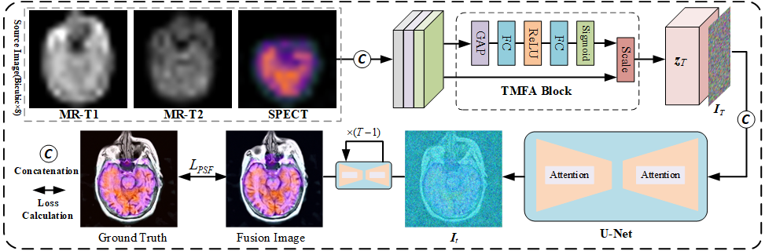

Simultaneous Tri-Modal Medical Image Fusion and Super-Resolution using Conditional Diffusion Model
===========

  <b>Simultaneous Tri-Modal Medical Image Fusion and Super-Resolution using Conditional Diffusion Model</b>, MICCAI 2024.
  <a href="https://arxiv.org/abs/2404.17357" target="blank">[arXiv]</a>

In clinical practice, tri-modal medical image fusion, compared to the existing dual-modal technique, can provide a more comprehensive view of the lesions, aiding physicians in evaluating the disease's shape, location, and biological activity. However, due to the limitations of imaging equipment and considerations for patient safety, the quality of medical images is usually limited, leading to sub-optimal fusion performance, and affecting the depth of image analysis by the physician. Thus, there is an urgent need for a technology that can both enhance image resolution and integrate multi-modal information. Although current image processing methods can effectively address image fusion and super-resolution individually, solving both problems synchronously remains extremely challenging. In this paper, we propose TFS-Diff, a simultaneously realize tri-modal medical image fusion and super-resolution model. Specially, TFS-Diff is based on the diffusion model generation of a random iterative denoising process. We also develop a simple objective function and the proposed fusion super-resolution loss, effectively evaluates the uncertainty in the fusion and ensures the stability of the optimization process. And the channel attention module is proposed to effectively integrate key information from different modalities for clinical diagnosis, avoiding information loss caused by multiple image processing. Extensive experiments on public Harvard datasets show that TFS-Diff significantly surpass the existing state-of-the-art methods in both quantitative and visual evaluations.

  

  

	  <b>Highlights</b>
  

1. The TFS-Diff model synchronously implements end-to-end tri-modal image fusion and super-resolution processing, eliminating the need for manually designing complex fusion and super-resolution network architectures. This significantly simplifies the model design process.
2. We propose a feature fusion module based on a channel attention mechanism that can learn and extract shared features and modality-specific features from different modal medical images.
3. A new fusion and super-resolution loss function is proposed to retain the sharpness, texture and contrast information of the medical images into the fused result. Meanwhile, it guarantees the stability of the model training process and the high quality of the fused results.

## Citations
Please consider citing our paper in your publications if the project helps your research. BibTeX reference is TBD.

