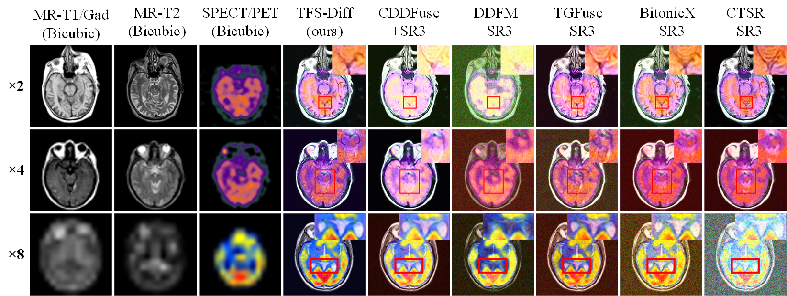

Simultaneous Tri-Modal Medical Image Fusion and Super-Resolution using Conditional Diffusion Model
===========
<details>
<summary>
  <b>Simultaneous Tri-Modal Medical Image Fusion and Super-Resolution using Conditional Diffusion Model</b>, <span style="color:red;">MICCAI 2024</span>.
  <a href="https://arxiv.org/abs/2404.17357" target="blank">[arXiv]</a>
</summary>

In clinical practice, tri-modal medical image fusion, compared to the existing dual-modal technique, can provide a more comprehensive view of the lesions, aiding physicians in evaluating the disease's shape, location, and biological activity. However, due to the limitations of imaging equipment and considerations for patient safety, the quality of medical images is usually limited, leading to sub-optimal fusion performance, and affecting the depth of image analysis by the physician. Thus, there is an urgent need for a technology that can both enhance image resolution and integrate multi-modal information. Although current image processing methods can effectively address image fusion and super-resolution individually, solving both problems synchronously remains extremely challenging. In this paper, we propose TFS-Diff, a simultaneously realize tri-modal medical image fusion and super-resolution model. Specially, TFS-Diff is based on the diffusion model generation of a random iterative denoising process. We also develop a simple objective function and the proposed fusion super-resolution loss, effectively evaluates the uncertainty in the fusion and ensures the stability of the optimization process. And the channel attention module is proposed to effectively integrate key information from different modalities for clinical diagnosis, avoiding information loss caused by multiple image processing. Extensive experiments on public Harvard datasets show that TFS-Diff significantly surpass the existing state-of-the-art methods in both quantitative and visual evaluations.
</details>

## Framework

<div align="center">
  
</div>

## Image Fusion Example

<div align="center">
  
</div>

## 🎓 Citation

Please cite our paper:

```bibtex
              @InProceedings{ Xu_Simultaneous_MICCAI2024,
                 author = { Xu, Yushen and Li, Xiaosong and Jie, Yuchan and Tan, Haishu },
                 title = { { Simultaneous Tri-Modal Medical Image Fusion and Super-Resolution using Conditional Diffusion Model } }, 
                 booktitle = {Medical Image Computing and Computer Assisted Intervention -- MICCAI 2024},
                 year = {2024},
                 publisher = {Springer Nature Switzerland},
                 volume = { LNCS 15007 },
                 month = {October},
                 pages = { pending },
              }
```

## Usage
### Environment
```python
pip install -r requirement.txt
```


### Prepare Data

Download the dataset on [Google Drive]()\|[Baidu Yun]()
| Harvard Datasets                       | Platform                                     | 
| -------------------------------------- | ------------------------------------------------------------ |
| 128×128 -> 256×256  | [Google Drive]()\|[Baidu Yun]() |  
| 64×64 -> 256×256    | Coming soon |   
| 32×32 -> 256×256    | Coming soon | 

### Testing

**1. Pre-trained models**
| Tasks                             | Platform                                     | 
| -------------------------------------- | ------------------------------------------------------------ |
| 128×128 -> 256×256 on Harvard Datasets | [Google Drive]()\|[Baidu Yun](https://pan.baidu.com/s/1jdCBgvFuWCB6pmg2tym_Iw?pwd=00o6 
提取码：00o6 
--来自百度网盘超级会员V6的分享) |  
| 64×64 -> 256×256 on Harvard Datasets   | Coming soon |   
| 32×32 -> 256×256 on Harvard Datasets   | Coming soon | 

```python
# Download the pretrained model and edit [sr|sample]_[ddpm|sr3]_[resolution option].json about "resume_state":
"resume_state": [checkpoint path]
```

```python
# run the script
python infer.py -c [config file]
```

### Training

```python
# Use sr.py and sample.py to train the super resolution task and unconditional generation task, respectively.
# Edit json files to adjust network structure and hyperparameters
python sr.py -p train -c config/sr_sr3.json
```

## Acknowledgements

Our work is based on the following theoretical works:

- [Image-Super-Resolution-via-Iterative-Refinement](https://github.com/Janspiry/Image-Super-Resolution-via-Iterative-Refinement/tree/master)


